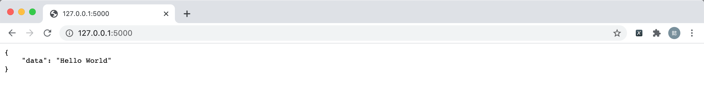
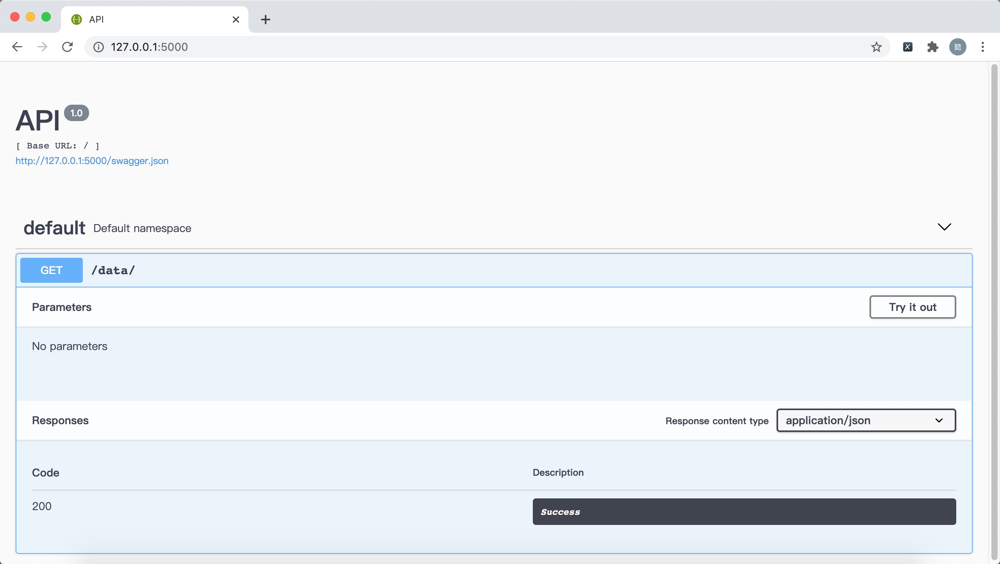
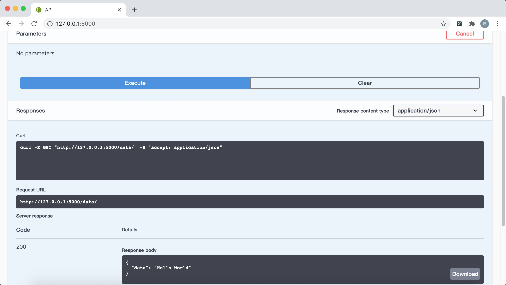
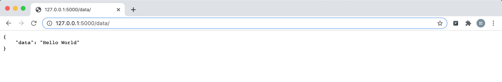

<h2 align= center> Flask-RESTPlus 组件 </h2>

<h5 align=right> 极客点儿 </h5>

 2020-08-15 

在讲解 `Flask-RESTPlus` 组件之前，我们先看下另一个重要的组件 `Flask-RESTful`。

### 一、Flask-RESTful

关于 `RESTful` 是什么，已经在 [RESTfulAPI架构设计](RESTfulAPI架构设计.md) 中进行了详细的讲解。而 `Flask-RESTful` 则是实现了 `RESTful` 规范的一套基于 `Flask` 的框架，它能够快速构建 `RESTful APIs`。

`Flask-RESTful` 代码示例：

	#!/usr/bin/env python3
	# -*- coding: UTF-8 -*-
	
	from flask import Flask
	from flask_restful import Resource, Api
	
	app = Flask(__name__)
	api = Api(app)
	
	
	class Main(Resource):
	    def get(self):
	        return {'data': 'Hello World'}
	
	
	api.add_resource(Main, '/')
	
	
	if __name__ == '__main__':
	    app.run(debug=True)
	    
运行结果：

	MacBook:~ zhangyi$ curl "http://127.0.0.1:5000/"
	{
	    "data": "Hello World"
	}

Flask-RESTful GitHub：[https://github.com/flask-restful/flask-restful](https://github.com/flask-restful/flask-restful)

Flask-RESTful 官方教程：[https://flask-restful.readthedocs.io/en/latest/](https://flask-restful.readthedocs.io/en/latest/)

### 二、Flask-RESTPlus

`Flask-RESTPlus` 同样也是实现了 `RESTful` 规范的一套基于 `Flask` 的框架。

`Flask-RESTPlus` 代码示例：

	#!/usr/bin/env python3
	# -*- coding: UTF-8 -*-
	
	from flask import Flask
	from flask_restplus import Resource, Api
	
	app = Flask(__name__)
	api = Api(app)
	
	
	class Main(Resource):
	    def get(self):
	        return {'data': 'Hello World'}
	
	
	api.add_resource(Main, '/data/')
	
	
	if __name__ == '__main__':
	    app.run(debug=True)

运行结果：

	MacBook:~ zhangyi$ curl "http://127.0.0.1:5000/data/"
	{
	    "data": "Hello World"
	}

Flask-RESTPlus GitHub：[https://github.com/noirbizarre/flask-restplus](https://github.com/noirbizarre/flask-restplus)

Flask-RESTPlus 官方教程：[https://flask-restplus.readthedocs.io/en/latest/](https://flask-restplus.readthedocs.io/en/latest/)

### 三、Flask-RESTful vs Flask-RESTPlus

既然 `Flask-RESTful` 和 `Flask-RESTPlus` 都是实现了 `RESTful` 规范的一套基于 `Flask` 的框架，那么他俩的区别到底在哪呢？

从上面的代码我们可以看出，除了在引入包的时候名字不一样之外，其他全都一模一样，通过命令行请求方式、返回结果也是一模一样。既然命令行请求的方式都一样，那在看下浏览器的请求方式也是一样的吗。

**Flask-RESTful**

**Flask-RESTPlusl**

从上图可以看出 `Flask-RESTPlus` 比 `Flask-RESTful` 多了一个 `Swagger` 的界面（`Swagger` 是通过代码配置从而自动生成接口文档的工具，能做到调用端、服务端、接口文档的一致性）。通过 `Try it out` 可以 `/data/` 接口的数据。

当然也可以使用完整的 `URL` 来调用 `/data/` 接口的数据。

通过上述可以得知，`Flask-RESTful` 和 `Flask-RESTPlus` 最重要的区别只有一个（少数语法糖和扩展忽略） ，就是 `Flask-RESTPlus` 可以自动生成接口文档。

至于二者为什么会如此相似？那是因为 `Flask-RESTPlus` 是 `Flask-RESTful` 的分支。从 `Github` 上我们可以通过提交的历史记录可以看到 `Flask-RESTPlus` 变化。

既然二者绝大部分都一样，那我们学习其中一个即可，因为 `Flask-RESTPlus`  是增强版的 `Flask-RESTful` ，所以建议直接学习 `Flask-RESTPlus`。

### 四、 `Flask-RESTPlus` 组件

#### 1. 初始化
	
	from flask import Flask
	from flask_restplus import Api
	
	app = Flask(__name__)
	api = Api(app)

#### 2. 代码示例

	from flask import Flask
	from flask_restplus import Resource, Api
	
	app = Flask(__name__)
	api = Api(app)
	
	
	class Main(Resource):
	    def get(self):
	        return {'data': 'Hello World'}
	
	
	api.add_resource(Main, '/data/')
	
	
	if __name__ == '__main__':
	    app.run(debug=True)

#### 3. 路由管理

	class Main(Resource):
	    def get(self):
	        return {'data': 'Hello World'}
	        
	api.add_resource(Main, '/data/')
	
路由一般是通过 `api.add_resource()` 添加的，不过 `Flask-RESTPlus` 有路由语法糖。

	@api.route('/data/')
	class Main(Resource):
	    def get(self):
	        return {'data': 'Hello World'}
	        
可以通过  `@api.route()` 来替代 `api.add_resource()`。

#### 4. 请求方式

`REST` 是针对资源进行操作，通俗来讲，就是一个 `URL` 通过不同的请求方式对应着不同的操作。代码中 `class Main()` 这个类就一个资源（`URL`）。

	@api.route('/')
	class Main(Resource):
	
	    def get(self):
	        pass
	        
	    def post(self):
	        pass
	    
	    def put(self):
	        pass
	    
	    def delete(self):
	        pass
	     
`HTTP` 常用的请求方式有 `GET`、`POST`、`PUT`、`DELETE`，对应着 `Flask-RESTPlus` 中的方法就是 `get()`、`post()`、`put()`、`delete()`。

#### 5. 参数解析

通过接口传入数据需要后端进行正确的解析才可以处理，我们使用 `flask` 自带的 `request` 模块进行解析。

	from flask import request

	@api.route('/')
	class Main(Resource):
	    
	    def get(self):
	        data = request.args
	        return data
	
	    def post(self):
	        data = request.json
	        return data
	
	    def put(self):
	        data = request.json
	        return data
	
	    def delete(self):
	        data = request.args
	        return data
	       
最常用的两种解析方式：

- `request.args` 用于 `get()`、`delete()` 解析。

- `request.json` 用户 `post()`、`put()` 解析。

#### 6. 使用蓝图

蓝图主要是为了将一个模块拆分成不同的模块，这样有利于代码结构的管理。

	from flask import Flask, Blueprint
	from flask_restplus import Resource, Api
	
	app = Flask(__name__)
	blueprint = Blueprint('api', __name__)
	api = Api(app=blueprint)
	
	
	@api.route('/')
	class Main(Resource):
	    def get(self):
	        return {'data': 'Hello World'}
	
	
	app.register_blueprint(blueprint)
	
	
	if __name__ == '__main__':
	    app.run(debug=True)

	
`Flask-RESTPlus` 和蓝图配合使用的方法很简单，只需要在初始化 `Api` 类的时候指定 `app` 为蓝图即可 `api = Api(app=blueprint)`。

#### 7. 数据标准化

`Flask-RESTPlus` 数据标准化是由**命名空间**、**数据格式化**、**DTO**三部分组成。

	from flask import Flask, Blueprint
	from flask_restplus import Resource, Api, Namespace, fields
	
	app = Flask(__name__)
	
	
	class UserDTO(object):
	    api = Namespace('数据格式', description='数据格式')
	    add_user_input = api.model('数据格式', {
	        'data': fields.String(required=True, description='数据')
	    })
	
	
	@UserDTO.api.route('/')
	class Main(Resource):
	    def get(self):
	        return {'data': 'Hello World'}
	
	
	blueprint = Blueprint('api', __name__)
	api = Api(app=blueprint)
	api.add_namespace(UserDTO.api, path='/data')
	app.register_blueprint(blueprint)
	
	
	if __name__ == '__main__':
	    app.run(debug=True)

- **命名空间**

	命名空间（`Namespace`）是表示一个标识符的可见范围，一个标识符可在多个名字空间中定义，它在不同名字空间中的含义是互不相干的。这样，在一个新的名字空间中可定义任何标识符，它们不会与任何已有的标识符发生冲突，因为已有的定义都处于其他名字空间中。
		
	命名空间本质上是隔离，类似程序中定义的局部变量。而在 `Flask-RESTPlus` 中，命名空间是为了隔离不同的资源，一般情况，一个资源定义一个命名空间。
		
	上述代码中，`api = Namespace('数据格式', description='数据格式')` 就是定义了一个命名空间。

- **数据格式化**

	和命名空间类似，命名空间需要导入 `Namespace`  类，数据格式化需要导入 `fields` 模块。
	
	- 基本格式
		
			from flask_restplus import Namespace, fields
			
			class UserDTO(object):
			    api = Namespace('数据格式', description='数据格式')
			    model = api.model('数据格式', {
			        'data': fields.String(required=True, description='数据')
			    })
	
	- 数据类型

		`fields` 支持 `20` 种数据类型，常用的有 `9` 种，分别是：`Integer`、`Float`、`String`、`Boolean`、`Url`、`Date`、`DateTime`、`List`、`Nested`。
	
		    data = api.model('数据', {
		        'str': fields.Url(),
		        'data': fields.Date(),
		        'datetime': fields.DateTime()
		    })
		    
		    model = api.model('数据格式', {
		        'int': fields.Integer(),
		        'str': fields.String(),
		        'bool': fields.Boolean(),
		        'list': fields.List(fields.String()),
		        'nested': fields.Nested(data),
		        'list[nested]': fields.List(fields.Nested(data))
		    })

		数据基本类型用法很简单，定义一个字典类型，键名是要呈现的对象的属性或键的名称，值是 `fields` 的数据类型。
		
			{
			  "str": "string",
			  "data": "string",
			  "datetime": "2020-09-03T01:57:49.933Z"
			}
		
		比较特殊的数据类型有两个：`List` 和 `Nested`。
		
		当接收或返回参数需要用到列表的时候，可直接使用 `List` 字段，前端对应的是 `JavaScript` 的 `Array` 数据类型，后端对应的是 `Python` 的 `list` 数据类型。
		
		`Nested` 是嵌套字段，可以指定另一个 `model`（另一个数据对象）将数据从一个扁平的数据对象变成一个嵌套响应的数据对象。
		
			{
			  "int": 0,
			  "str": "string",
			  "bool": true,
			  "list": [
			    "string"
			  ],
			  "nested": {
			    "str": "string",
			    "data": "string",
			    "datetime": "2020-09-03T01:57:49.931Z"
			  },
			  "list[nested]": [
			    {
			      "str": "string",
			      "data": "string",
			      "datetime": "2020-09-03T01:57:49.931Z"
			    }
			  ]
			}
		
		`List` 和 `Nested` 可以配合使用，直接使用 `Nested` 返回的数据格式是一个 `dict`，内部的值根据字段定义而来，将 `Nested` 嵌套在 `List` 之内，返回的数据格式是一个 `List`，内部的值是一个 `dict`。

	- 类型属性

		字段类型是可以通过属性来指定，常用的有：`default`（默认值）、`required`（必填项）、`description`（描述）、`attribute`（重命名）。

		`default` 的作用是在没有值的情况下充当预先定义好的值；`required` 的值是布尔型，来指定这个字段是否是必填项；`description` 是描述这个字段的信息，相当是注释； `attribute` 的作用是将内部字段映射为接口字段，这样可以隐藏后端内部字段。最常用的就这几个，如果想要查看完整的字段类型属性，请参考官方文档或阅读源码。

- **DTO**

	`DTO`（`Data Transfer Object`）又叫做数据传输对象，这个概念最早源于 `Java` 的设计模式，后来被引入微服务架构设计中。是展示层和服务层之间的数据传输对象，可以理解为展示层和服务层之间的数据传输的数据格式协议。
	
	前端表单输入的数据（展示层）与后端服务接收、返回的数据（服务层）以及数据库的字段都没有对应关系。`DTO` 通过命名空间和数据格式化两个维度来定义展示层和服务层之间字段的对应关系，从而实现数据格式协议。数据库中的字段和服务层中的字段并没有对应关系，主要目的是为了隐藏数据库中的字段数据类型。
	
	通俗来讲，`DTO` 是定义 `API` 入参和出参的数据格式，且有自己的命名空间。上述代码中，`class UserDTO(object):` 就是定义了一个 `DTO`。

#### 8. Swagger 装饰器

`Flask-RESTPlus` 相比于 `Flask-RESTful` 最大的区别是可以自动生成 `Swagger API` 文档，可通过 `Swagger` 装饰器来配置功能丰富的 `Swagger UI`。

| 装饰器 | 说明 |
|---|---|
| @api.model() | 指定 DTO 的数据格式 |
| @api.expect() | 指定输入参数 DTO 的数据格式 |
| @api.param() | 指定输入参数的数据格式 |
| @api.marshal\_with() | 指定 DTO 输出对象输出数据格式 |
| @api.marshal\_list\_with() | 指定 DTO 输出列表输出数据格式 |
| @api.response() | 指定预期状态码、返回值以及数据格式 |
| @api.route() | 指定各资源的子路由 |
| @api.doc() | 指定在原有参数的基础上增加任何附加参数 |
| @api.header() | 指定获取浏览器响应头的数据 |
| @api.parser() | 指定获取前端视图层自定义的数据 |

在实际开发中，上述表格中的装饰器已经能够结果绝大部门的问题，如果想查看完整的 `Swagger` 装饰器，请参考官方文档或阅读源码。

装饰器具体的使用请参考下一节的完整示例。
	
#### 9. 完整示例

	#!/usr/bin/env python3
	# -*- coding: UTF-8 -*-
	
	from flask import Flask, request, Blueprint
	from flask_restplus import Resource, Api, Namespace, fields
	from flask_sqlalchemy import SQLAlchemy
	
	
	app = Flask(__name__)
	
	app.config['SQLALCHEMY_DATABASE_URI'] = 'sqlite:////tmp/test.db'
	app.config['SQLALCHEMY_TRACK_MODIFICATIONS'] = True
	app.config['SQLALCHEMY_COMMIT_ON_TEARDOWN'] = True
	
	db = SQLAlchemy(app)
	
	
	class UserModel(db.Model):
	
	    __tablename__ = 'user'
	
	    id = db.Column(db.Integer, primary_key=True, autoincrement=True)
	    username = db.Column(db.String(32), nullable=True, default=None)
	    password = db.Column(db.String(32), nullable=True, default=None)
	
	
	class UserDTO(object):
	
	    api = Namespace('用户管理', description='用户管理')
	
	    add_user_input = api.model('新增用户', {
	        'username': fields.String(required=True, description='用户名'),
	        'password': fields.String(required=True, description='密码')
	    })
	
	    get_user_output = api.model('获取用户', {
	        'id': fields.Integer(required=True, description='用户id'),
	        'username': fields.String(required=True, description='用户名'),
	        'password': fields.String(required=True, description='密码')
	    })
	
	
	@UserDTO.api.route('/')
	class UserController(Resource):
	
	    @UserDTO.api.expect(UserDTO.add_user_input, validate=True)
	    def post(self):
	        """ 新增用户 """
	        data = add_user(request.json)
	        return data
	
	    @UserDTO.api.param('username', '用户名', required=True)
	    @UserDTO.api.marshal_with(UserDTO.get_user_output)
	    def get(self):
	        """ 获取用户 """
	        data = get_user(request.args)
	        return data
	
	
	def add_user(data):
	
	    username = data.get('username', None)
	    password = data.get('password', None)
	
	    db_data = {
	        'username': username,
	        'password': password
	    }
	
	    db_data = UserModel(**db_data)
	    db.session.add(db_data)
	    db.session.commit()
	
	    return True, 201
	
	
	def get_user(data):
	
	    username = data.get('username', None)
	    db_data = UserModel.query.filter(UserModel.username == username).first()
	
	    re_data = {
	        'id': db_data.id,
	        'username': db_data.username,
	        'password': db_data.password
	    }
	
	    return re_data, 200
	
	
	blueprint = Blueprint('api', __name__)
	api = Api(app=blueprint, title='标题', version='1.0', description='描述')
	api.add_namespace(UserDTO.api, path='/user')
	app.register_blueprint(blueprint)
	
	
	if __name__ == '__main__':
	    db.create_all()
	    app.run(debug=True, port=5000)
