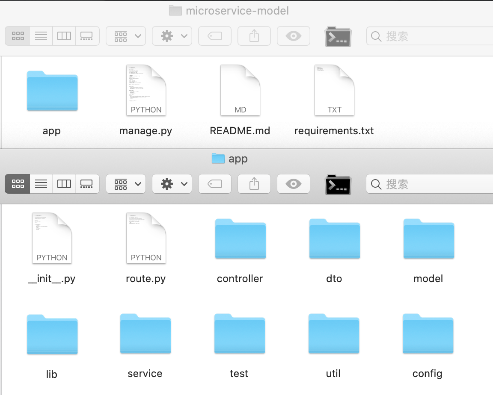
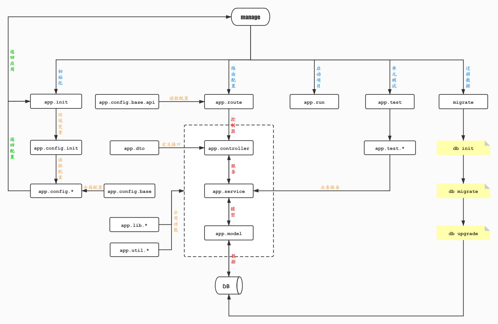

<h2 align= center> Flask 微服务框架 </h2>

<h5 align=right> 极客点儿 </h5>

 2020-08-23 

接下来讲解 `Flask` 微服务框架的目录结构和各个文件的作用以及各个功能，下面只是一个 `demo`，为了结构清晰，只保留了最核心的部分。

### 一、目录层级结构

	microservice-model
	├── README.md
	├── app
	│   ├── __init__.py
	│   ├── route.py
	│   ├── config
	│   │   ├── __init__.py
	│   │   ├── base_config.py
	│   │   ├── dev_config.py
	│   │   ├── prod_config.py
	│   │   ├── test_config.py
	│   │   └── unit_config.py
	│   ├── controller
	│   │   ├── __init__.py
	│   │   └── user_controller.py
	│   ├── dto
	│   │   ├── __init__.py
	│   │   └── user_dto.py
	│   ├── lib
	│   │   ├── __init__.py
	│   │   ├── datetimeLib.py
	│   │   └── encryptLib.py
	│   ├── model
	│   │   ├── __init__.py
	│   │   └── user_model.py
	│   ├── service
	│   │   ├── __init__.py
	│   │   └── user_service.py
	│   ├── test
	│   │   ├── __init__.py
	│   │   └── test_user_service.py
	│   └── util
	│       └── __init__.py
	├── manage.py
	└── requirements.txt
	
### 二、各层级结构含义

首先进入项目中，会看到一个目录 `app` 和三个文件 `manage.py`、`README.md`、`requirements.txt`。

- `app`：微服务的核心功能都在这里，包括初始化、路由、配置、控制器、`DTO`、程序库、数据库模型、服务、单元测试。

	- `__init__.py`：初始化文件
	
	- `route.py`：路由配置转发文件
	
	- `config`：配置文件目录
	
	- `controller`：控制器目录
	
	- `dto`：数据传输对象目录
	
	- `lib`：程序库目录
	
	- `model`：数据库模型目录
	
	- `service`：服务目录
	
	- `test`：单元测试目录
	
	- `util`：公共模块目录
	
- `README.md`：项目的说明文档或入门手册，里面介绍了整个项目的使用、功能、配置、部署等项目相关问题。

- `manage.py`：用于管理项目的命令行工具和入口文件，整个项目中用到的所有命令集都封装在 `manage.py` 中，使用的时候直接调用即可。

### 三、项目架构流程图

### 四、项目架构代码详解

#### 1. 初始化

首先从入口文件 `manage.py` 开始分析。

**_manage.py_**

	#!/usr/bin/env python3
	# -*- coding: UTF-8 -*-
	
	import os
	import unittest
	
	from app import create_app, db
	from app.route import blueprint
	
	from flask_cors import CORS
	from flask_script import Manager
	from flask_migrate import Migrate, MigrateCommand
	
	
	# 获取环境变量
	env = os.getenv('RUNTIME_ENV') or 'dev'
	# 创建 app
	app = create_app(env)
	# 加载蓝图
	app.register_blueprint(blueprint)
	
	# 创建 manager
	manager = Manager(app)
	# 创建 migrate
	migrate = Migrate(app, db)
	# 新增 db 到 manager 中
	manager.add_command('db', MigrateCommand)
	
	# 跨域请求
	CORS(app, supports_credentials=True)
	
	
	@manager.command
	def run():
	    """ runs user permission and auth service """
	    db.create_all()
	    app.run(debug=True, host='0.0.0.0', port=5000)
	
	
	@manager.command
	def create():
	    """ runs create db all data """
	    db.drop_all()
	    db.create_all()
	    db.session.commit()
	
	
	@manager.command
	def test():
	    """ runs the unit tests """
	    tests = unittest.TestLoader().discover('app/test', pattern='test*.py')
	    result = unittest.TextTestRunner(verbosity=2).run(tests)
	    if result.wasSuccessful():
	        return 0
	    return 1
	
	
	if __name__ == '__main__':
	    manager.run()

首先，获取环境变量，然后调用 `create_app()` 创建 `app`。`create_app()` 在 `__init__.py` 初始化文件中。现在来看下 `app/__init__.py` 文件中都有些什么。

**_app/\_\_init\_\__.py**

	# !/usr/bin/env python3
	# -*- coding: UTF-8 -*-
	
	from flask import Flask
	from flask_sqlalchemy import SQLAlchemy
	
	from app.config import read_config
	
	
	# 创建 app
	app = Flask(__name__)
	
	# 创建 db
	db = SQLAlchemy()
	
	
	def create_app(env):
	
	    # 读取环境变量
	    app.config.from_object(read_config(env))
	    
	    # 注册 db
	    db.init_app(app)
	
	    return app
	    
`__init__.py` 首先实例化 `Flask` 对象 `app`，然后又实例化了 `SQLAlchemy` 对象 `db`。

俺么 `manage.py` 调用 `create_app()` 之后又做了些什么呢？

`app` 配置（`app.config.from_object()` ）需要通过读取环境变量来获取具体配置参数。`create_app()` 接收环境变量参数后通过 `read_config(env)` 拿到 `app` 的详细配置。

`read_config(env)` 是调用 `app/config/__init__.py` 文件，详细代码如下：

**_app/config/\_\_init\_\_.py_**

	#!/usr/bin/env python3
	# -*- coding: UTF-8 -*-
	
	from app.config.dev_config import DevConfig
	from app.config.test_config import TestConfig
	from app.config.prod_config import ProdConfig
	from app.config.unit_config import UnitConfig
	
	
	def read_config(config_name):
	
	    if config_name == 'dev':
	        return DevConfig
	
	    if config_name == 'test':
	        return TestConfig
	
	    if config_name == 'prod':
	        return ProdConfig
	
	    if config_name == 'unit':
	        return ProdConfig

`read_config` 通过传来的 `config_name` 参数来决定使用哪个配置文件（例如，这里默认是 `dev` 配置文件）。然后返回 `DevConfig` 类。

**_app/config/dev\_config.py_**

	#!/usr/bin/env python3
	# -*- coding: UTF-8 -*-
	
	from app.config.base_config import Config
	
	
	class DevConfig(Config):
	    SQLALCHEMY_DATABASE_URI = 'sqlite:////tmp/test.db'
	    SQLALCHEMY_TRACK_MODIFICATIONS = True
	    SQLALCHEMY_COMMIT_ON_TEARDOWN = True
	    
这个是 `dev` 的配置文件，它继承了基础配置类 `app.config.base_config.Config`。

	#!/usr/bin/env python3
	# -*- coding: UTF-8 -*-
	
	api_config = {
	    'title': '用户权限认证服务 API',
	    'version': '1.0',
	    'description': '所有与用户相关的 RESTful API 服务'
	}
	
	
	class Config(object):
	
	    SECRET_KEY = '5e8bca1c9aaa34aed6d069be3dfccd31'
	    SQLALCHEMY_TRACK_MODIFICATIONS = False

拿到配置后就可以沿原路返回了，一直到 `app/__init__.py` 文件中，将 `db` 注册到 `app` 里，然后将创建好的 `app` 返回到 `manage.py` 中。

**_app/\_\_init\_\__.py**

	def create_app(env):
	
	    # 读取环境变量
	    app.config.from_object(read_config(env))
	    
	    # 注册 db
	    db.init_app(app)
	
	    return app

**_manage.py_**
	
	# 获取环境变量
	env = os.getenv('RUNTIME_ENV') or 'dev'
	# 创建 app
	app = create_app(env)

#### 2. 路由配置

接下来，就开始配置路由，还是到入口文件。

**_manage.py_**

	from app.route import blueprint

	# 加载蓝图
	app.register_blueprint(blueprint)
	
首先，我们根据加载蓝图找到 `app/route` 中的 `blueprint`。

**_app/route.py_**

	# !/usr/bin/env python3
	# -*- coding: UTF-8 -*-
	
	from flask import Blueprint
	from flask_restplus import Api
	
	from app.config.base_config import api_config
	from app.controller.user_controller import api as user
	
	
	# 创建蓝图
	blueprint = Blueprint('api', __name__)
	# 创建 REST API
	api = Api(blueprint, **api_config)
	
	# 注册路由
	api.add_namespace(user, path='/user')

在 `app/route` 中，先创建蓝图，然后再创建 `REST API`，`Api` 配置文件需要到 `app/config/base_config.api_config` 中获取。

**_app/config/base\_config.py_**

	#!/usr/bin/env python3
	# -*- coding: UTF-8 -*-
	
	api_config = {
	    'title': '用户权限认证服务 API',
	    'version': '1.0',
	    'description': '所有与用户相关的 RESTful API 服务'
	}

拿到配置文件后就可以注册路由了，路由是通过映射到控制器中。

**_app/controller/user\_controller.py_**

	#!/usr/bin/env python3
	# -*- coding: UTF-8 -*-
	
	from flask import request
	from flask_restplus import Resource
	
	from app.dto.user_dto import UserDTO
	from app.service.user_service import add_user, get_user
	
	
	api = UserDTO.api
	add_user_input = UserDTO.add_user_input
	get_user_output = UserDTO.get_user_output
	
	
	# 用户相关操作
	@api.route('')
	@api.response(200, 'SUCCESS')
	@api.response(400, 'BAD REQUEST')
	@api.response(401, 'NOT AUTHORIZED')
	@api.response(404, 'NOT FOUND')
	class Users(Resource):
	
	    @api.expect(add_user_input, validate=True)
	    def post(self):
	        """ 新增用户 """
	        data = add_user(request.json)
	        return data
	
	    @api.param('phone', '电话')
	    @api.marshal_with(get_user_output)
	    def get(self):
	        """ 获取用户 """
	        data = get_user(request.args)
	        return data
	        
控制器是逻辑处理的中转站，首先要通过 `DTO` 对接口文档进行定义。

**_app/dto/user\_dto.py_**

	#!/usr/bin/env python3
	# -*- coding: UTF-8 -*-
	
	from flask_restplus import Namespace, fields
	
	
	class UserDTO(object):
	
	    api = Namespace('用户管理', description='用户相关操作')
	
	    add_user_input = api.model('新增用户', {
	        'phone': fields.String(required=True, description='电话'),
	        'username': fields.String(required=True, description='姓名'),
	        'mail': fields.String(required=False, description='邮箱')
	    })
	
	    get_user_output = api.model('获取用户', {
	        'id': fields.Integer(required=True, description='用户id'),
	        'phone': fields.String(required=True, description='电话'),
	        'username': fields.String(required=True, description='姓名'),
	        'mail': fields.String(required=True, description='邮箱')
	    })

定义好接口之后就是我们真正的业务服务了，之前都是架构上需要执行的流程，最终业务服务都是在 `app/service/*` 中进行的。

**_app/service/user\_service.py_**

	#!/usr/bin/env python3
	# -*- coding: UTF-8 -*-
	
	from app import db
	from app.model.user_model import Users
	
	
	# 新增用户
	def add_user(data):
	
	    phone = data.get('phone', None)
	    username = data.get('username', None)
	    mail = data.get('mail', None)
	
	    if phone is not None and username is not None:
	
	        db_data = {
	            'phone': phone,
	            'username': username,
	            'mail': mail
	        }
	
	        db_data = Users(**db_data)
	        db.session.add(db_data)
	        db.session.commit()
	
	        return True, 201
	
	    else:
	        return False, 400
	
	
	# 获取用户
	def get_user(data):
	
	    phone = data.get('phone', None)
	
	    if phone is not None:
	
	        db_data = Users.query.filter(Users.phone == phone).first()
	
	        if db_data is not None:
	
	            re_data = {
	                'id': db_data.id,
	                'phone': db_data.phone,
	                'mail': db_data.mail,
	                'username': db_data.username
	            }
	
	        else:
	            return False, 400
	
	        return re_data, 200
	
	    else:
	        return False, 400

业务服务需要用到 `model`。

**_app/model/user\_model.py_**

	#!/usr/bin/env python3
	# -*- coding: UTF-8 -*-
	
	from app import db
	
	
	# 用户表
	class Users(db.Model):
	
	    __tablename__ = 'users'
	
	    id = db.Column(db.Integer, primary_key=True, autoincrement=True)
	    phone = db.Column(db.String(11), unique=True, index=True)
	    mail = db.Column(db.String(64), nullable=True, default=None)
	    username = db.Column(db.String(128), nullable=True, default=None)

到此为止，我们项目的核心模块就介绍完了，还有一些辅助性的模块，是为了对项目结构更好的划分。

`app/lib/` 下是放置着一些程序库。

**_app/lib/datetimeLib.py_**

	#!/usr/bin/env python3
	# -*- coding: UTF-8 -*-
	
	import re
	import arrow
	import time as _time
	
	
	# 时间日期操作
	class DateTimeLib(object):
	
	    """
	        * 返回年、月、日、时、分、秒的属性和方法
	    """
	    @property
	    def year(self):
	        return str(arrow.now('+08:00').year)
	
	    @staticmethod
	    def year_orm():
	        return str(arrow.now('+08:00').year)
	
	    @property
	    def month(self):
	        return str(arrow.now('+08:00').month)
	
	    @staticmethod
	    def month_orm():
	        return str(arrow.now('+08:00').month)
	
	    @property
	    def day(self):
	        return str(arrow.now('+08:00').day)
	
	    @staticmethod
	    def day_orm():
	        return str(arrow.now('+08:00').day)
	
	    @property
	    def hour(self):
	        return str(arrow.now('+08:00').hour)
	
	    @staticmethod
	    def hour_orm():
	        return str(arrow.now('+08:00').hour)
	
	    @property
	    def minute(self):
	        return str(arrow.now('+08:00').minute)
	
	    @staticmethod
	    def minute_orm():
	        return str(arrow.now('+08:00').minute)
	
	    @property
	    def second(self):
	        return str(arrow.now('+08:00').second)
	
	    @staticmethod
	    def second_orm():
	        return str(arrow.now('+08:00').second)
	
	    # 返回日期的属性和方法
	    @property
	    def date(self):
	        return str(arrow.now('+08:00').date())
	
	    @staticmethod
	    def date_orm():
	        return str(arrow.now('+08:00').date())
	
	    # 返回时间的属性和方法
	    @property
	    def time(self):
	        return str(arrow.now('+08:00').time()).split('.')[0]
	
	    @staticmethod
	    def time_orm():
	        return str(arrow.now('+08:00').time()).split('.')[0]
	
	    # 返回日期时间的属性和方法
	    @property
	    def datetime(self):
	        return str(arrow.now('+08:00').datetime).split('.')[0]
	
	    @staticmethod
	    def datetime_orm():
	        return str(arrow.now('+08:00').datetime).split('.')[0]
	
	    # 返回无格式日期的属性和方法
	    @property
	    def dt(self):
	        return str(arrow.now('+08:00').date()).replace('-', '')
	
	    @staticmethod
	    def dt_orm():
	        return str(arrow.now('+08:00').date()).replace('-', '')
	
	    # 返回当前时间戳
	    @property
	    def timestamp(self):
	        return str(arrow.now('+08:00').timestamp)
	
	    # 日期时间 <转> 时间戳
	    @staticmethod
	    def dt2ts(sdt):
	        return str(arrow.get(sdt).to('+08:00').timestamp)
	
	    # 时间戳 <转> 日期时间
	    @staticmethod
	    def ts2dt(sts):
	        return str(arrow.get(int(sts)).to('+08:00')).split('+')[0].replace('T', ' ')
	
	    # 移动时间和日期 <sdt>:传入时间日期 <tp>:返回类型 <Other>:要移动的参数
	    def move_dt(self, sdt=None, stp=None, year=0, month=0, day=0, hour=0, minute=0, second=0, week=0):
	
	        # sdt 默认为当前日期
	        if sdt is None:
	            sdt = self.datetime
	
	        datetime = str(arrow.get(sdt).shift(years=year, months=month, days=day, weeks=week, hours=hour,
	                                            minutes=minute, seconds=second)).split('+')[0].replace('T', ' ')
	        date = datetime.split(' ')[0]
	        time = datetime.split(' ')[1]
	
	        # tp 默认返回 date
	        if stp == 'datetime':
	            return datetime
	
	        elif stp == 'time':
	            return time
	
	        else:
	            return date
	
	    # 一个时间段内的连续日期列表 ['2019-09-06', '2019-09-07', '2019-09-08']
	    def list_dt(self, sdate=None, edate=None):
	
	        if sdate is None and edate is None:
	            sdate_str = self.date
	            edate_str = self.date
	        else:
	            sdate_str = sdate
	            edate_str = edate
	
	        start_date = arrow.get(sdate_str)
	        end_date = arrow.get(edate_str)
	
	        days = str(end_date - start_date).split(' ')[0]
	
	        # 如果开始时间和结束时间是一样的，则会返回特殊字符，对特殊字符特殊处理
	        if days == '0:00:00':
	            days = 0
	        else:
	            days = int(days)
	
	        date_list = []
	
	        for day in range(days + 1):
	            next_date = self.move_dt(sdt=sdate_str, day=day)
	            date_list.append(next_date)
	
	        return date_list
	
	    # 只针对最常用的 '0000-00-00' 和 '00000000' 格式相互转换，其他特殊格式根据所提供的功能全都可以灵活实现
	    @staticmethod
	    def format_dt(sdt):
	
	        # 传入参数为 '0000-00-00' 格式
	        if re.match(r'^[0-9]{4}-[0-9]{2}-[0-9]{2}$', sdt) is not None:
	            return sdt.replace('-', '')
	
	        # 传入参数为 '00000000' 格式
	        if re.match(r'^[0-9]{8}$', sdt) is not None:
	            return sdt[0:4] + '-' + sdt[4:6] + '-' + sdt[6:8]
	
	        # 格式错误返回 None
	        return None
	
	    # 休眠
	    @staticmethod
	    def sleep(sp=0):
	        _time.sleep(sp)
	
	
	dt = DateTimeLib()

**_app/lib/encryptLib.py_**

	#!/usr/bin/env python3
	# -*- coding: UTF-8 -*-
	
	import bcrypt
	import hashlib
	import base64 as b64
	
	
	class EncryptLib(object):
	
	    @staticmethod
	    def _init_(data):
	        return data.encode(encoding='UTF-8')
	
	    def md5(self, data):
	        return hashlib.md5(self._init_(data)).hexdigest()
	
	    def sha1(self, data):
	        return hashlib.sha1(self._init_(data)).hexdigest()
	
	    def sha224(self, data):
	        return hashlib.sha224(self._init_(data)).hexdigest()
	
	    def sha256(self, data):
	        return hashlib.sha256(self._init_(data)).hexdigest()
	
	    def sha384(self, data):
	        return hashlib.sha384(self._init_(data)).hexdigest()
	
	    def sha512(self, data):
	        return hashlib.sha512(self._init_(data)).hexdigest()
	
	    def base64(self, data):
	        return str(b64.b64encode(self._init_(data)), 'UTF-8')
	
	    @staticmethod
	    def generate_salt():
	        return str(bcrypt.gensalt(), 'UTF-8')
	
	    @staticmethod
	    def generate_password_hash(password, salt, rounds=8):
	
	        if not password or not salt:
	            raise ValueError('Password and salt must be non-empty.')
	
	        if isinstance(password, str):
	            password = bytes(password, 'UTF-8')
	
	        if isinstance(salt, str):
	            salt = bytes(salt, 'UTF-8')
	
	        return str(bcrypt.hashpw(password + salt, bcrypt.gensalt(rounds)), 'UTF-8')
	
	    @staticmethod
	    def check_password_hash(password, salt, pw_hash):
	
	        if isinstance(password, str):
	            password = bytes(password, 'UTF-8')
	
	        if isinstance(salt, str):
	            salt = bytes(salt, 'UTF-8')
	
	        if isinstance(pw_hash, str):
	            pw_hash = bytes(pw_hash, 'UTF-8')
	
	        return bcrypt.checkpw(password+salt, pw_hash)
	
	
	et = EncryptLib()

`app/util` 下面放置着是一些公用代码。

**_app/util/check\_token.py_**

	#!/usr/bin/env python3
	# -*- coding: UTF-8 -*-
	
	import traceback
	
	from app import app
	from app.util.handle_token import handle_token
	from app.util.return_value import *
	from functools import wraps
	
	
	# token 校验
	def check_token(f):
	    @wraps(f)
	    def check(*args, **kwargs):
	
	        app.logger.debug('🔑 token校验:[START] >> 🟢 ==> %s' % f)
	
	        try:
	            token = handle_token.verify_token()
	
	            if token is None:
	                return_value_401[0]['message'] = 'token校验失败'
	                app.logger.error('🔑 token校验:[ERROR] >> 🔴 ==> %s' % return_value_401[0])
	                return return_value_401
	
	            app.logger.debug('🔑 token校验:[END] >> 🟢 ==> token校验成功')
	            return f(*args, **kwargs)
	
	        except BaseException as e:
	            traceback.print_exc()
	            app.logger.error('🔑 token校验:[ERROR] >> 🔴 ==> %s:%s' % (return_value_500[0], e))
	            return return_value_500
	
	    return check

#### 3. 迁移数据

我们的项目是通过 `Flask-Migrate` 组件进行数据迁移处理。

首先，看下 `Flask-Migrate` 提供的命令。

	(microservice-model) MacBook:microservice-model zhangyi$ python manage.py db
	usage: Perform database migrations
	
	Perform database migrations
	
	positional arguments:
	  {init,revision,migrate,edit,merge,upgrade,downgrade,show,history,heads,branches,current,stamp}
	    init                Creates a new migration repository
	    revision            Create a new revision file.
	    migrate             Alias for 'revision --autogenerate'
	    edit                Edit current revision.
	    merge               Merge two revisions together. Creates a new migration file
	    upgrade             Upgrade to a later version
	    downgrade           Revert to a previous version
	    show                Show the revision denoted by the given symbol.
	    history             List changeset scripts in chronological order.
	    heads               Show current available heads in the script directory
	    branches            Show current branch points
	    current             Display the current revision for each database.
	    stamp               'stamp' the revision table with the given revision; don't run any migrations
	
	optional arguments:
	  -?, --help            show this help message and exit

接下来就是迁移顺序，[Flask-Migrate 组件](Flask-Migrate组件.md) 中有详细介绍。

1. 使用 `init` 初始化，将 `ORM` 对象生成可执行的 `SQL`。

2. 使用 `migrate` 将生成的 `SQL` 迁移到数据库。

3. 使用 `upgrade` 将 `SQL` 表结构更新到数据库中。

**初始化**

	(microservice-model) MacBook:microservice-model zhangyi$ python manage.py db init 
	  Creating directory /Users/zhangyi/Documents/vianet/microservice-model/migrations ...  done
	  Creating directory /Users/zhangyi/Documents/vianet/microservice-model/migrations/versions ...  done
	  Generating /Users/zhangyi/Documents/vianet/microservice-model/migrations/script.py.mako ...  done
	  Generating /Users/zhangyi/Documents/vianet/microservice-model/migrations/env.py ...  done
	  Generating /Users/zhangyi/Documents/vianet/microservice-model/migrations/README ...  done
	  Generating /Users/zhangyi/Documents/vianet/microservice-model/migrations/alembic.ini ...  done
	  Please edit configuration/connection/logging settings in '/Users/zhangyi/Documents/vianet/microservice-model/migrations/alembic.ini' before proceeding.

**迁移数据**
	
	(microservice-model) MacBook:microservice-model zhangyi$ python manage.py db migrate
	INFO  [alembic.runtime.migration] Context impl SQLiteImpl.
	INFO  [alembic.runtime.migration] Will assume non-transactional DDL.
	INFO  [alembic.autogenerate.compare] Detected added table 'users'
	INFO  [alembic.autogenerate.compare] Detected added index 'ix_users_phone' on '['phone']'
	  Generating /Users/zhangyi/Documents/vianet/microservice-model/migrations/versions/48775ada3bd1_.py ...  done

**更新到数据库**

	(microservice-model) MacBook:microservice-model zhangyi$ python manage.py db upgrade
	INFO  [alembic.runtime.migration] Context impl SQLiteImpl.
	INFO  [alembic.runtime.migration] Will assume non-transactional DDL.
	INFO  [alembic.runtime.migration] Running upgrade  -> 48775ada3bd1, empty message

#### 4. 单元测试

单元测试是项目开发中必不可少的一个环节，它的作用是保证了代码的质量和改动代码后的风险。如果以后改动代码后，跑一下单元测试就知道我们的改动会不会影响之前的业务逻辑。

单元测试需要安装 `flask_testing` 包。

**_app/test/\_\_init\_\_.py_**

	#!/usr/bin/env python3
	# -*- coding: UTF-8 -*-
	
	from flask_testing import TestCase
	from app import create_app, db
	
	
	class BaseTestCase(TestCase):
	    """ Base Tests """
	
	    def create_app(self):
	        return create_app('dev')
	
	    def setUp(self):
	        db.drop_all()
	        db.create_all()
	        db.session.commit()
	
	    def tearDown(self):
	        db.session.remove()
	        db.drop_all()

**_app/test/test\_user\_service.py_**

	#!/usr/bin/env python3
	# -*- coding: UTF-8 -*-
	
	import unittest
	
	from app.test import BaseTestCase
	from app.service.user_service import add_user, get_user
	

	class TestUser(BaseTestCase):
	
	    # 新增用户正向测试
	    def test_positive_add_user(self):
	
	        test_data = {
	            'phone': '13800001111',
	            'username': '极客点儿',
	            'mail': '13800001111@jk.com'
	        }
	
	        positive_add = add_user(test_data)
	        self.assertEqual(positive_add[0], True)
	
	    # 新增用户反向测试
	    def test_negative_add_user(self):
	
	        test_data = {}
	
	        negative_add = add_user(test_data)
	        self.assertEqual(negative_add[0], False)
	
	    # 获取用户正向测试
	    def test_positive_get_user(self):
	
	        test_data = {
	            'phone': '13800001111',
	            'username': '极客点儿',
	            'mail': '13800001111@jk.com'
	        }
	        add_user(test_data)
	
	        positive_set = get_user({'phone': '13800001111'})
	        self.assertEqual(positive_set[1], 200)
	
	    # 获取用户反向测试
	    def test_negative_get_user(self):
	
	        test_data = {
	            'phone': '13800001111',
	            'username': '极客点儿',
	            'mail': '13800001111@jk.com'
	        }
	        add_user(test_data)
	
	        negative_set = get_user({'phone': '13800001112'})
	        self.assertEqual(negative_set[0], False)
	
	
	if __name__ == '__main__':
	    unittest.main()

执行单元测试：

	(microservice-model) MacBook:microservice-model zhangyi$ python manage.py test
	test_negative_add_user (test_user_service.TestUser) ... ok
	test_negative_get_user (test_user_service.TestUser) ... ok
	test_positive_add_user (test_user_service.TestUser) ... ok
	test_positive_get_user (test_user_service.TestUser) ... ok
	
	----------------------------------------------------------------------
	Ran 4 tests in 0.063s
	
	OK
	
我们可以看到一共执行了 `4` 个函数而且都是通过状态，还有执行时间。

我们也可以定制单元测试，用来检测代码覆盖率，这个会在正式项目的代码出现，这里只是为了理解项目架构，不做过多介绍。

#### 5. 启动项目

开发环境的项目启动很简单，只需要 `app.run()` 就可以了。不过我们使用 `manage.py` 进行管理，启动项目在项目目录中执行：

	python manage.py run

运行结果：

	(microservice-model) MacBook:microservice-model zhangyi$ python manage.py run
	 * Serving Flask app "app" (lazy loading)
	 * Environment: production
	   WARNING: This is a development server. Do not use it in a production deployment.
	   Use a production WSGI server instead.
	 * Debug mode: on
	 * Running on http://0.0.0.0:5000/ (Press CTRL+C to quit)
	 * Restarting with stat
	 * Debugger is active!
	 * Debugger PIN: 327-506-227

