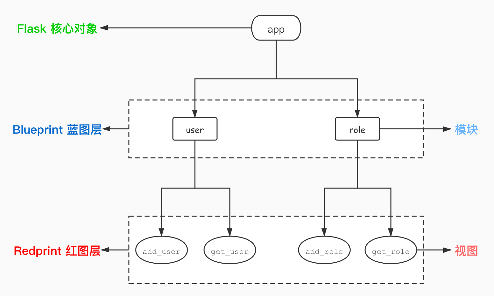

<h2 align= center> Flask 精简教程 </h2>

<h5 align=right> 极客点儿 </h5>

 2020-08-10 

### 一、Flask 简介

`Flask` 是一个 `Python` 编写的 `Web` 微框架。 `Flask` 只有一个微内核，类似 `Linux` 内核，而扩展出来的强大应用则对应着 `Linux` 各类发行版。

在介绍 `Flask` 之前，先拿它和 `Django` 做一个比较。

- `Django` 是个重量级的 `Web` 框架它内置许多模块，`Flask` 是一个小而精的轻量级微框架。

- `Django` 功能大而全， `Flask` 只包含基本的配置。

- `Django` 是一站式解决的思路，能让开发者不用在开发之前就在选择应用的基础设施上花费大量时间，`Flask` 则需要开发大量的基础设施，但是也使得 `Flask` 有优秀的灵活性、可扩展性，没那么多的限制和条条框框的约束。

- `Django` 内置模板、表单、路由、认证和基本的数据库管理等内建功能，而 `Flask` 只是一个微内核。

### 二、“微” 是什么意思？

**“微”**并不表示你需要把整个 `Web` 应用塞进单个 `Python` 文件，也不意味着 `Flask` 在功能上有所欠缺。微框架中的**“微”**意味着 `Python` 旨在保持核心简单而易于扩展。`Python` 不会替你做出太多决策，比如使用何种数据库。而那些 `Python` 所选择的，比如使用何种模板引擎，则很容易替换。除此之外的一切都由可由你掌握。如此，`Python` 可以与你珠联璧合。

默认情况下，`Python` 不包含数据库抽象层、表单验证，或是其它任何已有多种库可以胜任的功能。然而，`Python` 支持用扩展来给应用添加这些功能，如同是 `Python` 本身实现的一样。众多的扩展提供了数据库集成、表单验证、上传处理、各种各样的开放认证技术等功能。`Python` 也许是“微小”的，但它已准备好在需求繁杂的生产环境中投入使用。

### 三、第一个应用

一个最小的 `Flask`  应用看起来应该是什么样子的呢？

	from flask import Flask
	
	app = Flask(__name__)
	
	
	@app.route('/')
	def hello_world():
	    return 'Hello World!'
	
	
	if __name__ == '__main__':
	    app.run()

没错，就是这么简单优美！那么，这段代码做了什么？

- 首先，我们导入了 `Flask` 类，这个类的实例将会是我们的 `WSGI` 应用程序。

- 接下来，我们创建一个该类的实例，第一个参数是应用模块或者包的名称。 如果你使用单一的模块，你应该使用 `__name__`，因为模块的名称将会因其作为单独应用启动还是作为模块导入而有不同。这是必须的，这样  `Flask` 才知道到哪去找模板、静态文件等等。

- 然后，我们使用 `route()` 装饰器告诉 `Flask` 什么样的 `URL` 能触发我们的函数。

- 这个函数的名字也在生成 `URL` 时被特定的函数采用，这个函数返回我们想要显示在用户浏览器中的信息。

- 最后我们用 `run()` 函数来让应用运行在本地服务器上。 其中 `if __name__ == '__main__':` 确保服务器只会在该脚本被 `Python` 解释器直接执行的时候才会运行，而不是作为模块导入的时候。

### 四、调试模式

虽然 `run()` 方法适用于启动本地的开发服务器，但是你每次修改代码后都要手动重启它。这样并不够优雅，而且 `Flask` 可以做到更好。如果你启用了调试支持，服务器会在代码修改后自动重新载入，并在发生错误时提供一个相当有用的调试器。

有两种途径来启用调试模式。一种是直接在应用对象上设置:

	app.debug = True
	app.run()
	
另一种是作为 `run` 方法的一个参数传入:

	app.run(debug=True)
	
两种方法的效果完全相同，推荐使用第二种。

尽管交互式调试器在允许 `fork` 的环境中无法正常使用，但它依然允许执行任意代码。这使它成为一个巨大的安全隐患，因此它 绝对不能用于生产环境 

### 五、路由

现代 `Web` 应用的 `URL` 十分优雅，易于人们辨识记忆。

如上所见，`route()` 装饰器把一个函数绑定到对应的 `URL` 上，还有下面这些例子。

	@app.route('/')
	def index():
	    return 'Index Page'
	
	
	@app.route('/hello')
	def hello():
	    return 'Hello World'

但是，不仅如此！你可以构造含有动态部分的 `URL`，也可以在一个函数上附着多个规则。

### 六、变量规则

要给 `URL` 添加变量部分，你可以把这些特殊的字段标记为 `<variable_name>` ， 这个部分将会作为命名参数传递到你的函数。规则可以用 `<converter:variable_name>` 指定一个可选的转换器。

	@app.route('/user/<username>')
	def show_user_profile(username):
	    return 'User %s' % username
	
	
	@app.route('/post/<int:post_id>')
	def show_post(post_id):
	    return 'Post %d' % post_id
	    
转换器有三种：

- `int`：接受整数

- `float`：接受整数和浮点数

- `path`：和默认的相似，但也接受斜线

### 七、唯一 URL `/` 重定向

`Flask` 的 `URL` 规则基于 `Werkzeug` 的路由模块。这个模块背后的思想是基于 `Apache` 以及更早的 `HTTP` 服务器主张的先例，保证优雅且唯一的 `URL`。

以这两个规则为例:

	@app.route('/projects/')
	def projects():
	    return 'The project page'
	
	
	@app.route('/about')
	def about():
	    return 'The about page'

虽然它们看起来着实相似，但它们结尾斜线的使用在 `URL` 定义 中不同。 第一种情况中，指向 `projects` 的规范 `URL` 尾端有一个斜线。这种感觉很像在文件系统中的文件夹。访问一个结尾不带斜线的 `URL` 会被 `Flask` 重定向到带斜线的规范 `URL` 去。

然而，第二种情况的 URL 结尾不带斜线，类似 `UNIX-like` 系统下的文件的路径名。访问结尾带斜线的 `URL` 会产生一个 `404 Not Found` 错误。

这个行为使得在遗忘尾斜线时，允许关联的 `URL` 接任工作，与 `Apache` 和其它的服务器的行为并无二异。此外，也保证了 `URL` 的唯一，有助于避免搜索引擎索引同一个页面两次。

### 八、HTTP 方法

`HTTP` 有许多不同的访问 `URL` 方法。默认情况下，路由只回应 `GET` 请求，但是通过 `route()` 装饰器传递 `methods` 参数可以改变这个行为。改变请求方式需要依赖 `request` 库，命令行测试使用 `curl`，默认请求方式是 `GET`，要改变请求方式需加上 `-X` 参数。

	from flask import request
	

	@app.route('/login/', methods=['GET', 'POST'])
	def login():
	    if request.method == 'POST':
	        return 'POST \n'
	    else: 
	        return 'GET \n'

请求方式：

	curl -X GET http://127.0.0.1:5000/login/
	
	curl -X POST http://127.0.0.1:5000/login/	        	        
如果存在 `GET` ，那么也会替你自动地添加 `HEAD`，无需干预。它会确保遵照 `HTTP RFC` 处理 `HEAD` 请求，所以你可以完全忽略这部分的 `HTTP` 规范。

### 九、请求对象

当前请求的 `HTTP` 方法可通过 `method` 属性来访问。通过: `flask.request.form` 或 `flask.request.json` 属性来访问表单数据，通过 `flask.request.args` 属性来访问 `URL` 参数数据。

	#!/usr/bin/env python3
	# -*- coding: UTF-8 -*-
	
	import json
	from flask import Flask
	from flask import request
	
	app = Flask(__name__)
	
	
	@app.route('/login/', methods=['GET', 'POST', 'PUT'])
	def login():
	
	    if request.method == 'POST':
	
	        print(request.form)
	
	        for form in request.form:
	
	            data = json.loads(form)
	
	            username = data.get('username')
	            password = data.get('password')
	
	            return {'username': username, 'password': password}
	
	    elif request.method == 'PUT':
	
	        print(request.json)
	
	        username = request.json['username']
	        password = request.json['password']
	
	        data = {
	            'username': username,
	            'password': password
	        }
	
	        return data
	
	    else:
	
	        print(request.args)
	
	        username = request.args.get('username')
	        password = request.args.get('password')
	
	        data = {
	            'username': username,
	            'password': password
	        }
	
	        return data
	
	
	if __name__ == '__main__':
	    app.run(debug=True)

请求方式：
	    
	curl -X GET "http://127.0.0.1:5000/login/?username=admin&password=123"
	
	curl -X POST "http://127.0.0.1:5000/login/" -d "{\"username\": \"admin\", \"password\": 123}"
	
	curl -X PUT "http://127.0.0.1:5000/login/" -H "accept: application/json" -H "Content-Type: application/json" -d "{\"username\": \"admin\", \"password\": 123}"

在日常开发中，一般使用 `flask.request.json` 和 `flask.request.args`，`flask.request.form` 很少用。

### 十、 蓝图 vs 红图

#### 1. 蓝图

由于 `Flask` 是微内核的框架，核心代码只有几行。对于简单的项目来说（只有一个模块），所有的代码都是放在一个文件内就可以了（上面介绍 `Flask` 的所有代码也是这么做的）。

但如果项目有很多模块（例如有：`user`、 `role`、 `auth`、 `data`、 `menu` 等），那么这么多的模块的视图、模型、控制器、配置等代码都放到一个文件中会导致代码十分混乱。

首先，代码的管理很不方便；其次，后期功能的修改、扩展、维护变得异常困难；再次，如多人开发情况下，在一个文件中修改代码，会导致业务代码经常出现冲突，或者要弃用某个功能的话，就需要去文件中找到所有的相关功能代码并一一删除。

示例代码，所有功能都在一个文件中。

**_app.py_**

	#!/usr/bin/env python3
	# -*- coding: UTF-8 -*-
	
	from flask import Flask
	
	app = Flask(__name__)
	
	
	@app.route('/user/add/')
	def add_user():
	    return '新增用户 \n'
	
	
	@app.route('/user/get/')
	def get_user():
	    return '获取用户 \n'
	
	
	@app.route('/role/add/')
	def add_role():
	    return '新增角色 \n'
	
	
	@app.route('/role/add/')
	def get_role():
	    return '获取角色 \n'
	
	
	if __name__ == '__main__':
	    app.run()

运行结果：

	MacBook:~ zhangyi$ curl -X GET http://127.0.0.1:5000/user/add/
	新增用户 
	MacBook:~ zhangyi$ curl -X GET http://127.0.0.1:5000/user/get/
	获取用户 
	MacBook:~ zhangyi$ curl -X GET http://127.0.0.1:5000/role/add/
	新增角色 
	MacBook:~ zhangyi$ curl -X GET http://127.0.0.1:5000/role/get/
	获取角色 

那这个问题怎么解决呢？答案就是分层、分模块设计（遇到问题不会解决的时候多加一层就可以解决！）！

起初，`Flask` 官方没有提供解决方案，随着越来越多的人都遇到这种问题，大家都苦不堪言。于是在各路大神的不断推动下，终于，在  `Flask 0.7` 版新增了**“蓝图”** `blueprints` 的概念，才算彻底解决了这个问题。

最后再看一下到底什么是蓝图？

蓝图是一个存储操作路由映射方法的容器，主要用来实现客户端请求和 `URL` 相互关联的功能。 

简单的理解，蓝图是 `Flask` 为了拆分项目中代码功能、目录结构将其用于实现单个应用的视图、模板、静态文件的集合。使用蓝图可以帮助我们实现模块化应用的功能。

#### 2. 蓝图执行步骤

- 在每个应用中创建一个蓝图对象

- 在视图函数上使用蓝图注册路由

- 在应用对象上注册这个蓝图对象

#### 3. 蓝图的使用

我们将第一节的代码使用蓝图进行拆分。

**_user.py_**

	#!/usr/bin/env python3
	# -*- coding: UTF-8 -*-
	
	from flask import Blueprint
	
	# 创建蓝图
	user = Blueprint('user', __name__)
	
	
	# 注册路由
	@user.route('/add/')
	def add_role():
	    return '新增角色 \n'
	
	
	# 注册路由
	@user.route('/get/')
	def get_role():
	    return '获取角色 \n'

**_role.py_**

	#!/usr/bin/env python3
	# -*- coding: UTF-8 -*-
	
	from flask import Blueprint
	
	# 创建蓝图
	role = Blueprint('role', __name__)
	
	
	# 注册路由
	@role.route('/add/')
	def add_role():
	    return '新增角色 \n'
	
	
	# 注册路由
	@role.route('/get/')
	def get_role():
	    return '获取角色 \n'

**_app.py_**

	#!/usr/bin/env python3
	# -*- coding: UTF-8 -*-
	
	from flask import Flask
	
	from user import user
	from role import role
	
	app = Flask(__name__)
	
	# 注册蓝图
	app.register_blueprint(user, url_prefix='/user')
	app.register_blueprint(role, url_prefix='/role')
	
	
	if __name__ == '__main__':
	    app.run(debug=True)
	    
运行结果：

	MacBook:~ zhangyi$ curl -X GET http://127.0.0.1:5000/user/add/
	新增角色 
	MacBook:~ zhangyi$ curl -X GET http://127.0.0.1:5000/user/get/
	获取角色 
	MacBook:~ zhangyi$ curl -X GET http://127.0.0.1:5000/role/add/
	新增角色 
	MacBook:~ zhangyi$ curl -X GET http://127.0.0.1:5000/role/get/
	获取角色
	
#### 4. 红图

按理说，已经有蓝图了，为什么还要引入红图呢？答案是拆分粒度太大。

蓝图是模块级别的拆分，它不能用来拆分视图函数。

要实现比模块级别下粒度更细、更具体的视图函数拆分（例如要把上节的代码按照请求方式拆分为多个模块）就需要自定义一个跟蓝图功能类似的模块，为了体现它跟蓝图的异曲同工之妙，我们将它命名为红图 **`(redprint)`**。

#### 5. 蓝图 vs 红图关系图

#### 6. 红图执行步骤

- 在每个视图中创建一个红图对象

- 在视图函数上使用红图注册路由

- 在每个应用中创建一个蓝图对象

- 在每个应用中将红图注册到蓝图上

- 在应用对象上注册这个蓝图对象

#### 7. 红图的使用

红图的使用和蓝图一样，首先实例化红图对象（暂时还未被定义，先不去定义，等到最后再定义），分别在 `user` 和 `role` 里创建实例 `api`。

**_user_**

	from redprint import Redprint
	
	# 创建红图
	api = Redprint('user')

**_role_**	
	
	from redprint import Redprint
	
	# 创建红图
	api = Redprint('role')
	
使用方式和蓝图一模一样，接下来用具体的示例演示一个同时使用蓝图和红图的完整项目。

#### 8. 项目目录结构
	.
	├── app.py
	├── redprint
	│   └── __init__.py
	├── role
	│   ├── __init__.py
	│   ├── add_role.py
	│   └── get_role.py
	└── user
	    ├── __init__.py
	    ├── add_user.py
	    └── get_user.py

#### 9. 各模块代码详情

**_add\_user.py_**

	#!/usr/bin/env python3
	# -*- coding: UTF-8 -*-
	
	from redprint import Redprint
	
	# 创建红图
	api = Redprint('user')
	
	
	# 注册路由
	@api.route('/')
	def add_user():
	    return '新增用户 \n'

**_get\_user.py_**

	#!/usr/bin/env python3
	# -*- coding: UTF-8 -*-
	
	from redprint import Redprint
	
	# 创建红图
	api = Redprint('user')
	
	
	# 注册路由
	@api.route('/')
	def get_user():
	    return '获取用户 \n'

**_user.py_**

	#!/usr/bin/env python3
	# -*- coding: UTF-8 -*-
	
	from flask import Blueprint
	
	from user import add_user, get_user
	
	
	# 创建蓝图
	def create_blueprint():
	    user = Blueprint('user', __name__)
	    add_user.api.register(user, url_prefix='/add')
	    get_user.api.register(user, url_prefix='/get')
	    return user

**_add\_role.py_**

	#!/usr/bin/env python3
	# -*- coding: UTF-8 -*-
	
	from redprint import Redprint
	
	# 创建红图
	api = Redprint('role')
	
	
	# 注册路由
	@api.route('/')
	def add_role():
	    return '新增角色 \n'

**_get\_role.py_**

	#!/usr/bin/env python3
	# -*- coding: UTF-8 -*-
	
	from redprint import Redprint
	
	# 创建红图
	api = Redprint('role')
	
	
	# 注册路由
	@api.route('/')
	def get_role():
	    return '获取角色 \n'

**_role.py_**

	#!/usr/bin/env python3
	# -*- coding: UTF-8 -*-
	
	from flask import Blueprint
	
	from role import add_role, get_role
	
	
	# 创建蓝图
	def create_blueprint():
	    role = Blueprint('role', __name__)
	    add_role.api.register(role, url_prefix='/add')
	    get_role.api.register(role, url_prefix='/get')
	    return role

**_app.py_**

	#!/usr/bin/env python3
	# -*- coding: UTF-8 -*-
	
	from flask import Flask
	
	from user import create_blueprint as user
	from role import create_blueprint as role
	
	app = Flask(__name__)
	
	# 注册蓝图
	app.register_blueprint(user(), url_prefix='/user')
	app.register_blueprint(role(), url_prefix='/role')
	
	
	if __name__ == '__main__':
	    app.run(debug=True)

运行结果：

	MacBook:~ zhangyi$ curl -X GET http://127.0.0.1:5000/user/add/
	新增用户 
	MacBook:~ zhangyi$ curl -X GET http://127.0.0.1:5000/user/get/
	获取用户 
	MacBook:~ zhangyi$ curl -X GET http://127.0.0.1:5000/role/add/
	新增角色 
	MacBook:~ zhangyi$ curl -X GET http://127.0.0.1:5000/role/get/
	获取角色 

#### 10. 红图的定义

既然红图的功能和蓝图一样，那么红图的实现自然可以参考蓝图的实现方式。

先看下 `Blueprint` 的源码，主要用到三个重要方法：`__init__`、`register`、`route`。

	class Blueprint(_PackageBoundObject):
	
	    def __init__(
	        self,
	        name,
	        import_name,
	        static_folder=None,
	        static_url_path=None,
	        template_folder=None,
	        url_prefix=None,
	        subdomain=None,
	        url_defaults=None,
	        root_path=None,
	        cli_group=_sentinel,
	    ):
	        _PackageBoundObject.__init__(
	            self, import_name, template_folder, root_path=root_path
	        )
	        self.name = name
	        self.url_prefix = url_prefix
	        self.subdomain = subdomain
	        self.static_folder = static_folder
	        self.static_url_path = static_url_path
	        self.deferred_functions = []
	        if url_defaults is None:
	            url_defaults = {}
	        self.url_values_defaults = url_defaults
	        self.cli_group = cli_group
        
	    def register(self, app, options, first_registration=False):
	        self._got_registered_once = True
	        state = self.make_setup_state(app, options, first_registration)
		
	        if self.has_static_folder:
	            state.add_url_rule(
	                self.static_url_path + "/<path:filename>",
	                view_func=self.send_static_file,
	                endpoint="static",
	            )
		
	        for deferred in self.deferred_functions:
	            deferred(state)
		
	        cli_resolved_group = options.get("cli_group", self.cli_group)
		
	        if not self.cli.commands:
	            return
		
	        if cli_resolved_group is None:
	            app.cli.commands.update(self.cli.commands)
	        elif cli_resolved_group is _sentinel:
	            self.cli.name = self.name
	            app.cli.add_command(self.cli)
	        else:
	            self.cli.name = cli_resolved_group
	            app.cli.add_command(self.cli)
		
	    def route(self, rule, **options):
	        def decorator(f):
	            endpoint = options.pop("endpoint", f.__name__)
	            self.add_url_rule(rule, endpoint, f, **options)
	            return f
	        return decorator

####  11. 实现 Redpoint

根据蓝图，接下来便可以着手来编写 `Redpoint` 的具体实现方法了，`Blueprint` 实现的具体细节这里不会深入探讨，因为我们以后会用到更高级的方式实现，`Redpoint` 只是作为了解，有兴趣的同学可以去看下源码。

**_redprint.py_**

	#!/usr/bin/env python3
	# -*- coding: UTF-8 -*-
	
	
	class Redprint(object):
	
	    def __init__(self, name):
	        self.name = name
	        self.mound = []
	
	    def route(self, rule, **options):
	        def decorator(f):
	            self.mound.append((f, rule, options))
	            return f
	        return decorator
	
	    def register(self, bp, url_prefix=None):
	        if url_prefix is None:
	            url_prefix = '/' + self.name
	        for f, rule, options in self.mound:
	            endpoint = options.pop("endpoint", f.__name__)
	            bp.add_url_rule(url_prefix + rule, endpoint, f, **options)