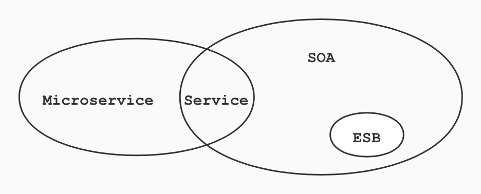

<h2 align= center> 微服务架构 </h2>

<h5 align=right> 极客点儿 </h5>
<h5 align=right> 2020-08-01 </h5>

### 一、架构是什么

架构，对于程序员来说是一个再常见不过的词了，但一直都是一知半解，大部分人也不一定能够准确地回答。今天我们就来深究一下，架构，到底指什么！

要想准确地回答这几个问题，关键在于梳理几个有关系而又相似的概念，包括：

- 系统与子系统

- 模块与组件

- 框架与架构

#### 1. 系统与子系统

先来看维基百科定义的系统。

> 系统泛指由一群有关联的个体组成，根据某种规则运作，能完成个别元件不能单独完成的工作的群体。它的意思是“总体”、“整体”或“联盟”。

提炼一下里面的关键内容：

- 关联：系统是由一群有关联的个体组成的，没有关联的个体堆在一起不能成为一个系统。例如，把一个发动机和一台 `PC` 放在一起不能称之为一个系统，把发动机、底盘、轮胎、车架组合起来才能成为一台汽车。

- 规则：系统内的个体需要按照指定的规则运作，而不是单个个体各自为政。规则规定了系统内个体分工和协作的方式。例如，汽车发动机负责产生动力，然后通过变速器和传动轴，将动力输出到车轮上，从而驱动汽车前进。

- 能力：系统能力与个体能力有本质的差别，系统能力不是个体能力之和，而是产生了新的能力。例如，汽车能够载重前进，而发动机、变速器、传动轴、车轮本身都不具备这样的能力。

再来看下子系统的定义。

> 子系统也是由一群有关联的个体所组成的系统，是更大系统中的一部分。

其实子系统的定义和系统定义是一样的，只是观察的角度有差异，一个系统可能是另外一个更大系统的子系统。

按照这个定义，系统和子系统比较容易理解。我们以微信为例来做一个分析。

- 微信本身是一个系统，包含聊天、登录、支付、朋友圈等子系统。

- 朋友圈这个系统又包括动态、评论、点赞等子系统。

- 评论这个系统可能又包括防刷子系统、审核子系统、发布子系统、存储子系统。

- 评论审核子系统不再包含业务意义上的子系统，而是包括各个模块或者组件，这些模块或者组件本身也是另外一个维度上的系统。例如，`MySQL`、`Redis` 等是存储系统，但不是业务子系统。

#### 2. 模块与组件

模块和组件两个概念在实际工作中很容易混淆，我们经常能够听到类似这样的说法：

- `MySQL` 模块主要负责存储数据， 而 `Elastic Search` 模块主要负责数据搜索。

- 我们有安全加密组件、有审核组件。

- `App` 的下载模块使用了第三方的组件。

造成这种现象的主要原因是，模块与组件的定义并不好理解，也不能很好地进行区分。我们来看看这两者在维基百科上的定义。

> 软件模块是一套一致而互相有紧密关连的软件组织。它分别包含了程序和数据结构两部分。现代软件开发往往利用模块作为合成的单位。模块的接口表达了由该模块提供的功能和调用它时所需的元素。模块是可能分开被编写的单位。这使它们可再用和允许人员同时协作、编写及研究不同的模块。

> 软件组件定义为自包含的、可编程的、可重用的、与语言无关的软件单元，软件组件可以很容易被用于组装应用程序中。

模块和组件都是系统的组成部分，只是从不同的角度拆分系统而已。从逻辑的角度来拆分系统后，得到的单元就是模块。

从物理的角度来拆分系统后，得到的单元就是组件。

划分模块的主要目的是职责分离，划分组件的主要目的是单元复用。

#### 3. 框架与架构

框架是和架构比较相似的概念，且两者有较强的关联关系，所以在实际工作中，这两个概念有时我们容易分不清楚。参考维基百科上框架与架构的定义来解释两者的区别。

> 软件框架通常指的是为了实现某个业界标准或完成特定基本任务的软件组件规范，也指为了实现某个软件组件规范时，提供规范所要求之基础功能的软件产品。

来提炼一下其中关键部分：

- 框架是组件规范：例如 `MVC` 就是一种最常见的开发规范。

- 框架提供基础功能的产品：例如 `Spring MVC` 是 `MVC` 的开发框架，除了满足 `MVC` 的规范，`Spring` 提供了很多基础功能来帮助我们实现功能。

参考维基百科的定义，我们将架构重新定义为：**软件架构指软件系统的顶层结构**。

这个定义看似很简单，但包含的信息很丰富，基本上把系统、子系统、模块、组件、架构等概念都串起来了。

首先，系统是一群关联个体组成，这些个体可以是子系统、模块、组件等，架构需要明确系统包含哪些个体。

其次，系统中的个体需要根据某种规则运作，架构需要明确个体运作和协作的规则。

再次，维基百科定义的架构用到了基础结构这个说法，我们将其改为**顶层结构**，可以更好地区分系统和子系统，避免将系统架构和子系统架构混淆在一起导致架构层次混乱。

单纯从定义的角度来看，框架和架构的区别还是比较明显的，框架关注的是规范，架构关注的是结构。框架的英文是 `Framework`， 架构的英文是 `Architecture`。

### 二、架构的演化

#### 1. 单体架构

单体架构，是将系统中所有的功能模块都堆积到一个运行环境中。 一般企业级的应用，如：`ERP`、`CRM`、`OA` 等都是单体架构。

单体架构是最基础的架构，一般都采用分层设计，所以单体架构也叫分层架构。

通常情况下，分层架构至少分为二层（`C/S`、`B/S`），最常见的是三层（`MVC`、`MVP`）。四层、五层的比较少见，只有特别复杂的系统才会达到四层、五层或者更高。

分层架构设计最核心的一点就是需要保证各层之间的差异足够清晰，边界足够明显，让人看到架构图后就能看懂整个架构。

**特点：**

- 所有的功能模块都堆积到一个运行环境中。

- 同时部署项目的所有功能到服务器。

- 应用系统和数据库分开独立部署。

- 通过部署应用集群和数据库集群来提高系统的性能。

**优点：**

- 架构简单清晰：只有分层架构，结构简单明了。

- 开发难度、成本低：初期开发成本低、周期短，开发难度低。

- 管理方便：随着项目进行可一直追踪进度。

**缺点：**

- 复杂性高：以一个百万行级别的单体应用为例，整个项目包含的模块非常多、模块的边界模糊、 依赖关系不清晰、 代码质量参差不齐、 混乱地堆砌在一起。可想而知整个项目非常复杂。 每次修改代码都心惊胆战， 甚至添加一个简单的功能， 或者修改一个 `Bug` 都会带来隐含的缺陷。

- 耦合性高：所有模块都相互耦合、数据相互关联。改动其中一个模块，影响依赖它的很多模块。

- 技术债重：随着时间推移、需求变更和人员更迭，会逐渐形成应用程序的技术债务， 并且越积 越多。“不坏不修”， 这在软件开发中非常常见， 在单体应用中这种思想更甚。 已使用的系统设计或代码难以被修改，因为应用程序中的其他模块可能会以意料之外的方式使用它。

- 可靠性差：某个应用 `Bug`，例如死循环、内存溢出等， 可能会导致整个应用的崩溃。

- 部署频率低：随着代码的增多，构建和部署的时间也会增加。而在单体应用中，每次功能的变更或缺陷的修复都会导致需要重新部署整个应用。全量部署的方式耗时长、影响范围大、风险高，这使得单体应用项目上线部署的频率较低。而部署频率低又导致两次发布之间会有大量的功能变更和缺陷修复，出错率比较高。

- 扩展能力受限：单体应用只能作为一个整体进行扩展，无法根据业务模块的需要进行伸缩。例如，应用中有的模块是计算密集型的，它需要强劲的 `CPU`，有的模块则是 `IO` 密集型的，需要更大的内存。由于这些模块部署在一起，不得不在硬件的选择上做出妥协。

- 阻碍技术创新：单体应用往往使用统一的技术平台或方案解决所有的问题，团队中的每个成员 都必须使用相同的开发语言和框架，要想引入新框架或新技术平台会非常困难。

#### 2. 分布式架构

分布式架构，是单体架构的并发扩展，将一个大的系统划分为多个业务模块，业务模块分别部署在不同的服务器上，各个业务模块之间通过接口进行数据交互。数据库也大量采用分布式数据库，如 `redis`、`ES`、`solor` 等。通过 `LVS/Nginx` 代理应用，将用户请求均衡的负载到不同的服务器上。

分布式架构一般通过单体架构集群进行扩展，所以分布式架构也叫做集群架构。

单体架构扩展可分为水平扩展和垂直扩展。水平扩展就是增加机器，垂直扩展就是增加配置。垂直扩展是有上限的，一般都是采用水平扩展。

采用水平扩展就需要将业务服务功能节点进行拆分，拆分成每个独立的系统服务（用户模块，订单模块，登录注册，后台管理模块等）。

**特点：**

- 由于单机受限，将应用拆成互不相干的几个模块以提升效率。

- 具有负载均衡的能力，大大提高了系统负载能力。

- 解决了网站高并发的需求。

**优点：**

- 降低了耦合度：把模块拆分,使用接口通信,降低模块之间的耦合度。

- 责任清晰：把项目拆分成若干个子项目,不同的团队负责不同的子项目。

- 扩展方便：增加功能时只需要再增加一个子项目,调用其他系统的接口就可以。

- 部署方便：可以灵活的进行分布式部署。

- 提高代码的复用性：对于不同的客户端都可以采用分布式 `rest` 服务方式，共用一个 `service` 层。

**缺点：**

- 系统之间的交互要使用远程通信。

- 接口开发难度增大，工作量增多。

- 后期维护管理成本增加。

#### 3. SOA 架构

`SOA` 的全称是（`Service Oriented Architecture`），中文翻译为面向服务的架构。

`SOA` 提出了 `3` 个关键概念：

**服务**

所有业务功能都是一项服务，服务就意味着要对外提供开放的能力，当其他系统需要使用这
项功能时，无须定制化开发。

服务可大可小，可简单也可复杂。例如，人力资源管理可以是一项服务，包括人员基本信息管理、请假管理、组织结构管理等功能；而人员基本信息管理也可以作为一项独立的服务，组织结构管理也可以作为一项独立的服务。到底是划分为粗粒度的服务，还是划分为细粒度的服务，需要根据企业的实际情况进行判断。

**ESB**

`ESB` 的全称是（`Enterprise Service Bus`），中文翻译为“企业服务总线”。

从名字就可以看出，`ESB` 参考了计算机总线的概念。计算机中的总线将各个不同的设备连接在一起，`ESB` 将企业中各个不同的服务连接在一起。因为各个独立的服务是异构的，如果没有统一的标准， 则各个异构系统对外提供的接口是各式各样的。

`SOA` 使用 `ESB` 来屏蔽异构系统对外提供各种不同的接口方式，以此来达到服务间高效的互联互通。

**松耦合**

松耦合的目的是减少各个服务间的依赖和互相影响。

因为采用 `SOA` 架构后，各个服务是相互独立运行的，甚至都不清楚某个服务到底有多少对其他服务的依赖。如果做不到松耦合，某个服务一升级，依赖它的其他服务全部故障，这样肯定是无法满足业务需求的。但实际上真正做到松耦合并没有那么容易，要做到完全后向兼容，是一项复杂的任务。

**特点：**

- 把功能模块拆分，所有业务功能都是一项服务。

- 使用 `ESB` 来屏蔽异构系统对外提供各种不同的接口方式，以此来达到服务间高效的互联互通。

- 松耦合，减少各个服务间的依赖和互相影响。

**优点：**

- 把模块拆分，使用接口通信，降低模块之间的耦合度。

- 把项目拆分成若干个子项目，不同的团队负责不同的子项目。

- 增加功能时只需要在增加一个子项目，调用其它系统的接口就可以。

- 可以灵活的进行分布式部署。

**缺点：**

- 系统之间交互需要使用远程通信。

- 传输协议和数据格式不统一。

- ESB性能低下，性能瓶颈无法突破。

- 接口开发增加工作量。

#### 4. 微服务架构

**微服务起源**

微服务（`Microservices`）的起源是由 `Peter Rodgers` 博士于 `2005` 年度云计算博览会提出的微 `Web` 服务开始。其核心想法是让服务是由类似 `Unix` 管道的访问方式使用，而且复杂的服务背后是使用简单 `URI` 来开放接口，任何服务，任何细粒都能被开放。这个设计在 `HP` 的实验室被实现，具有改变复杂软件系统的强大力量。

`2014` 年，`Martin Fowler` 与 `James Lewis` 共同提出了微服务的概念，定义了微服务是由以单一应用程序构成的小服务，自己拥有自己的行程与轻量化处理，服务依业务功能设计，以全自动的方式部署，与其他服务使用 `HTTP API` 通信。同时服务会使用最小的规模的集中管理能力，服务可以用不同的编程语言与数据库等组件实现。

**微服务思想**

微服务架构的核心思想是，一个应用是由多个小的、相互独立的、微服务组成，这些服务运行在自己的进程中，开发和发布都没有依赖。

每个服务定义了明确的边界，不同的服务甚至可以采用不同的编程语言来实现，由独立的团队来维护。

不同服务通过一些轻量级交互机制来通信，每个服务都是独立的组件，可以、扩展、伸缩、复用、替换，降低耦合，易维护。

服务之间互相调用，提高代码复用，开发效率。简单的来说，一个系统的不同模块转变成不同的服务！而且服务可以使用不同的技术加以实现！

**微服务与 `SOA` 的关系**

对于上述微服务的描述，你可能会疑惑，这和上节讲的 `SOA` 部署一样的吗？其实你想的没错，微服务与 `SOA` 的之间确实有关系，正是先有了 `SOA`，才发展出微服务，但它们本质上是不同的。

**微服务与 `SOA` 的对比**

- 服务粒度

	整体上来说，`SOA` 的服务粒度要粗一些，而微服务的服务粒度要细一些。例如，对一个大型企业来说，员工管理系统就是一个 `SOA` 架构中的服务。
	
	而如果采用微服务架构， 则员工管理系统会被拆分为更多的服务，比如员工信息管理、员工考勤管理、员工假期管理和员工福利管理等更多服务。

- 服务通信

	`SOA` 采用了 `ESB` 作为服务间通信的关键组件，负责服务定义、服务路由、消息转换、消息传递， 总体上是重量级的实现。
	
	微服务推荐使用统一的协议和格式，例如使用 `HTTP`、`RESTful` 协议，无须 `ESB` 这样的重量级实现。

- 服务交付

	`SOA` 对服务的交付并没有特殊要求， 因为 `SOA` 更多考虑的是兼容已有的系统。
	
	微服务的架构理念要求“快速交付”，相应地要求采取自动化测试、持续集成、自动化部署等敏捷开发相关的最佳实践。如果没有这些基础能力支撑，微服务规模一旦变大（例如超过20个微服务），整体就难以达到快速交付的要求，这也是很多在实行微服务时踩过的一个明显的坑，就是系统拆分为微服务后，部署的成本呈指数上升。

- 应用场景

	`SOA` 更加适合于庞大、复杂、异构的企业级系统， 这也是 `SOA` 诞生的背景。这类系统的典型特征就是很多系统已经发展多年，采用不同的企业级技术，有的是内部开发的，有的是外部购买的，无法完全推倒重来或者进行大规模的优化和重构。因为成本和影响太大，只能采用兼容的方式进行处理， 而承担兼容任务的就是 `ESB`。
	
	微服务更加适合于快速、轻量级、基于 `Web` 的互联网系统，这类系统业务变化快，需要快速尝试、快速交付。同时基本都是基于 `Web`，虽然开发技术可能差异很大(例如 `Java`、`Python`、`Golang` 等) ，但对外接口基本都是提供 `HTTP RESTful` 风格的接口，无须考虑在接口层进行类似 `SOA` 的 `ESB` 那样的处理。

`SOA` 和微服务对比如下：

| 对比维度 | SOA | 微服务 |
|---|---|---|
| 服务粒度 | 粗 | 细 |
| 服务通信 | 重量级，ESB | 轻量级，HTTP RESTful |
| 服务交付 | 慢 | 快 |
| 应用场景 | 企业级 | 互联网 |

综合上述分析，`SOA` 和微服务本质上是两种不同的架构设计理念。只是在“服务”这个点上有交集，两者都关注“服务”，都是通过服务的拆分来解决可扩展性问题。本质上不同的地方在于几个核心理念的差异是：是否有 `ESB`、服务的粒度、架构设计的目标等。

**特点：**

- 业务按服务拆分，单个服务尽量专注一件事情，高内聚、低耦合。

- 技术栈可以根据需求按服务选择不同技术栈。

- 隔离性进程隔离方式，故障范围有效控制。

- 每个服务可以独立的开发、测试、构建、部署。

- 快速沟通小团队开发，小且灵活，降低代码耦合度导致的沟通成本。

- 定制化可以根据市场需求，灵活多变的组合出新的业务场景。

- 演进优化可以按照服务粒度进行演进优化。

**优点：**

- 团队独立：每个服务都是一个独立开发团队，服务间互相独立，互不干扰，交付周期每个服务可以独立的开发、测试和交付，降低周期。

- 技术独立：面向服务是每个服务都要对外暴露 `RESTful API` 接口，并不关心技术的实现与平台和语言无关。

- 前后端分离：采用前后端分离开发，后端无需关心前端技术栈和客户端（`PC`、移动端、小程序等），统一使用 `RESTful API` 接口，反之前端无需关心后端使用的语言、技术栈、数据库等，直接调用 `RESTful API` 接口即可。

- 数据库分离：每个服务都可以使用自己的数据源。

- 运行效率高： 单个微服务代码量小、依赖少、运行快。

- 易于开发维护： 一个微服务只会关注一个特定的业务功能，所以它业务清晰、代码量较少。 开发和维护单个微服务相对简单。而整个应用是由若干个微服务构建而成的，所以整个应用也会被维持在一个可控状态。

- 服务容易修改： 单体应用只要有修改，就得重新部署整个应用，微服务解决了这样的问题。 一般来说，对某个微服务进行修改，只需要重新部署这个服务即可。

- 技术栈不受限：在微服务架构中，可以结合项目业务及团队的特点，合理地选择技术栈。

- 部署独立：服务间虽然有调用，但是要做到服务重启不影响其他服务。有利于持续交付和集成。

**缺点：**

- 开发投入多：分布式系统开发的技术成本高，容错、分布式事务、服务注册、服务发现、服务之间通信、重试机制、熔断机制、限流、降级、负载均衡等都对团队有很大的挑战。

- 运维要求高：更多的服务意味着更多的运维投入。在单体架构中，只需要保证一个应用的正常运行。而在微服务中，需要保证几十甚至几百个服务服务的正常运行与协作，这给运维带来了很大的挑战。

- 分布式固有的复杂性：使用微服务构建的是分布式系统。对于一个分布式系统，系统容错、网络延迟、分布式事务等都会带来巨大的挑战。

- 接口调整成本高：微服务之间通过接口进行通信。如果修改某一个微服务的 `API`，可能所有使用了该接口的微服务都需要做调整。

- 重复劳动：很多服务可能都会使用到相同的功能，而这个功能并没有达到分解为一个微服务的程度，这个时候，可能各个服务都会开发这一功能，从而导致代码重复。尽管可以使用共享库来解决这个问题（例如可以将这个功能封装成公共组件，需要该功能的微服务引用该组件），但共享库在多语言环境下就不一定行得通了。
